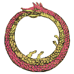
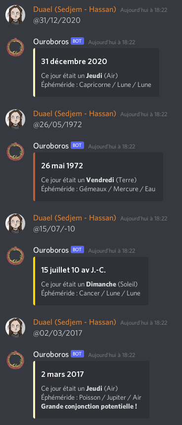
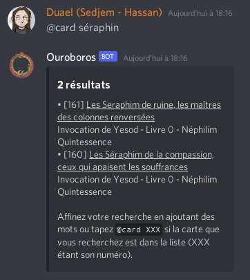
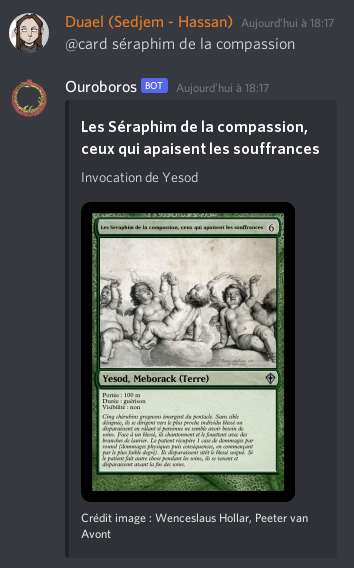

# Ouroboros (Bot Discord)

Ce dépôt contient le code d'un bot Discord dont l'objectif est d'aider les
personnes qui jouent à Nephilim Quintessence en ligne à obtenir divers services.

## Inviter le bot sur votre serveur

1. Rendez-vous à [cette adresse](https://discordapp.com/oauth2/authorize?&client_id=737340186265911306&scope=bot&permissions=8)
1. Identifiez-vous et choisissez le serveur
1. Validez

## Utilisation

Il suffit d'envoyer le message `@help` sur un canal que le bot peut lire
où en message privé pour obtenir une liste des commandes disponibles.

### Éphéméride

En envoyant la commande `@JJ/MM/AAAA` le bot renverra une réponse détaillée 
indiquant :
- le jour de la semaine ;
- le Ka élément associé ;
- l'éphéméride de la date (signe astrologique, astre, Ka élément) ;
- s'il s'agit d'une grande conjonction potentielle.

Exemples :

### Cartes

Via la commande `@card` vous pouvez demander au bot de vous fournir le détail 
d'une invocation de Kabbale, d'un Sortilège ou d'une formule Alchimique.

Essayez `@card help` pour en savoir plus.

Exemples :

## Crédits

* Le logo est dans le domaine public et disponible sur [Wikipedia](https://fr.wikipedia.org/wiki/Ouroboros#/media/Fichier:Ouroboros.png).
* Nephilim Légende est un jeu de rôle édité par [Mnemos](https://www.mnemos.com/catalogue/coffret-nephilim-legende/).
* Les cartes sont inspirées du jeu de cartes à collectionner [Magic: The Gathering](https://magic.wizards.com/en).
  Elles ont été créées à l'aide du service en ligne [SMF Funcard Maker 2](https://funcardmaker.thaledric.fr/)
  et illustrées via un glanage manuel sur Internet. Chaque illustration est
  créditée lorsque la carte est affichée et vous pouvez retrouver la liste des
  cartes et des crédits dans le fichier [cards.csv](assets/cards.csv).

Si vous êtes ayant droit d'une illustration utilisée dans le cadre de ce
projet et que vous ne souhaitez pas qu'elle soit utilisée, n'hésitez pas à
[ouvrir une issue](https://github.com/DuaelFr/nephilim-almanac-bot/issues/new) !
