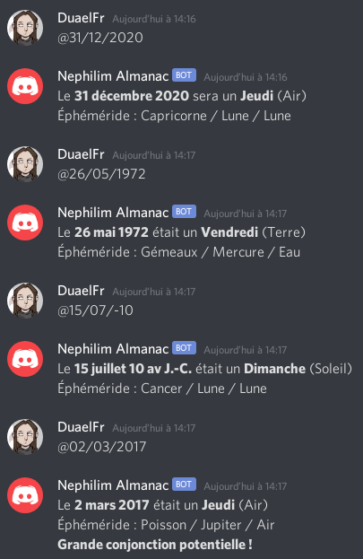

# Bot Éphéméride Nephilim

Ce dépôt contient le code d'un bot Discord dont l'objectif est d'aider les
personnes qui jouent à Nephilim Quintessence en ligne à obtenir l'éphéméride
correspondant à une date donnée.

## Inviter le bot sur votre serveur

1. Rendez-vous à [cette adresse](https://discordapp.com/oauth2/authorize?&client_id=737340186265911306&scope=bot&permissions=8)
1. Identifiez-vous et choisissez le serveur
1. Validez

## Utilisation

Il suffit d'envoyer le message `@JJ/MM/YYYY` sur un canal que le bot peut lire
où en message privé pour obtenir une réponse détaillée indiquant :
- le jour de la semaine ;
- le Ka élément associé ;
- l'éphéméride de la date (signe astrologique, astre, Ka élément) ;
- s'il s'agit d'une grande conjonction potentielle.

Exemples :

